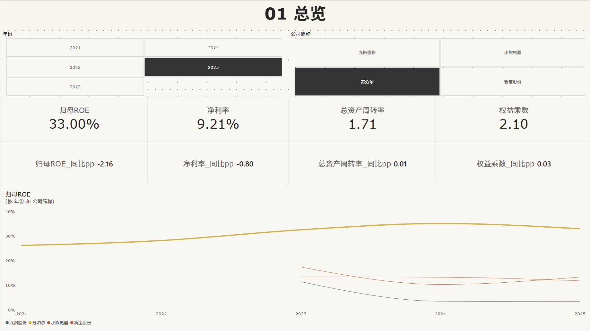
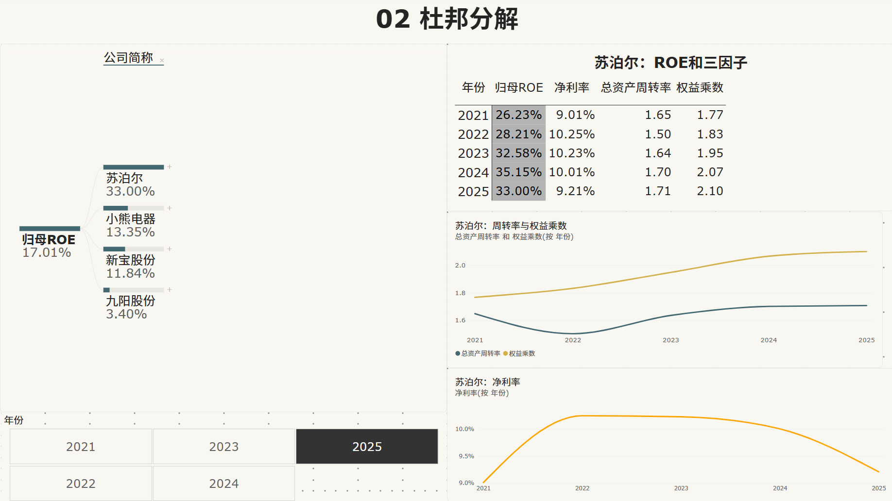
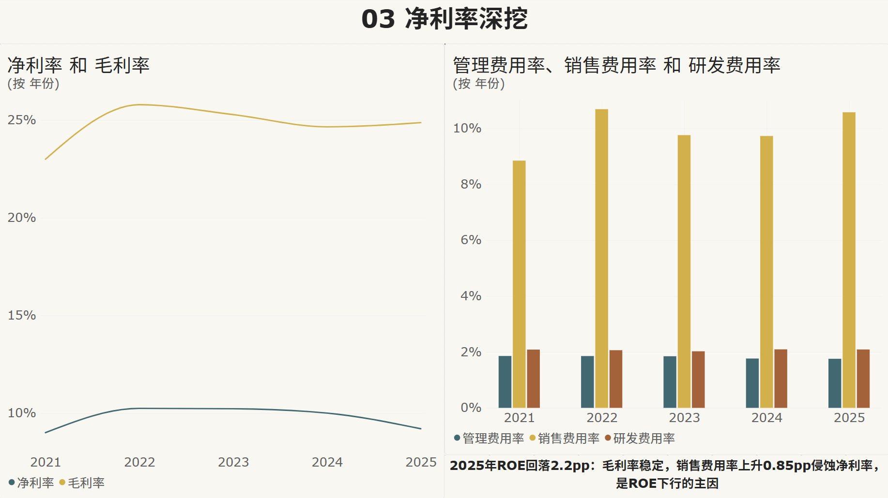

# 苏泊尔杜邦分析看板：ROE 三因子分解与同业对标

> 基于 A 股上市公司年报数据的杜邦分析项目，以苏泊尔（002032）为主分析对象、三家小家电同业为对标，构建"三表建模 → DAX 三因子度量值 → 分解树逐层下钻"的 Power BI 分析体系，定位 ROE 变动的因子级与费用级驱动原因。


---

## 📌 项目概览

以**归母 ROE = 销售净利率 × 总资产周转率 × 权益乘数**为分析框架，取苏泊尔 2020–2025 年及九阳股份、小熊电器、新宝股份三家可比公司年报数据，在 Power BI 中完成星型建模与 DAX 度量值体系，回答三个递进的问题：

1. **ROE 处于什么水平？**（总览：五年趋势 + 同业对标）
2. **由哪个因子驱动？**（杜邦分解：三因子逐年拆解 + 分解树定位）
3. **因子背后的业务原因是什么？**（净利率深挖：毛利率 vs 费用率归因）

**核心视角**：不止步于"算出三因子"，而是把杜邦作为**归因工具**——2021–2024 年 ROE 爬升与 2025 年回落，每一段变动都追溯到具体因子和具体费用科目。

---

## 🎯 核心成果速览

### 看板预览

#### 页面1：总览（KPI + 五年同业对标）


#### 页面2：杜邦分解（分解树 + 三因子矩阵与趋势）


#### 页面3：净利率深挖（毛利率 vs 费用率归因）


---

## 💡 关键发现与业务洞察

| 类别 | 发现 | 业务解读 |
|---|---|---|
| **ROE 驱动结构** | 苏泊尔归母 ROE 从 2021 年 26.2% 升至 2024 年 35.2%，同期净利率（≈10%）与周转率（1.5–1.7）基本走平，权益乘数从 1.77 升至 2.10 | ROE 爬升几乎完全由杠杆因子贡献——而公司无有息负债，杠杆来自**经营性占款 + 高分红压缩净资产**（2025 年度分红率 99.95%），是"无息杠杆"的典型样本 |
| **2025 年拐点归因** | 2025 年 ROE 回落 2.2pp 至 33.0%，三因子中周转率、乘数仍在上行，唯净利率由 10.0% 降至 9.2% | 分解树 + 因子矩阵双视图锁定净利率为唯一下行因子 |
| **费用级钻取** | 2025 年毛利率 24.9% 保持稳定，销售费用率由 9.73% 升至 10.58%（+0.85pp），管理/研发费用率走平 | 净利率下滑非成本端问题，而是**销售费用投放加大**所致——归因链条：ROE↓ → 净利率↓ → 销售费用率↑ |
| **同业对标** | 2025 年归母 ROE：苏泊尔 33.0% vs 小熊电器 13.4% / 新宝股份 11.8% / 九阳股份 3.4% | 苏泊尔的因子组合（高周转 + 无息杠杆 + 稳定净利率）在小家电同业中显著领先 |
| **口径差异** | 本项目计算的 ROE（期初期末简单平均）与年报披露的加权平均 ROE 存在 1–2pp 系统性差异 | 差异源于分母口径：证监会加权平均法考虑分红/增发时点权重，杜邦拆解惯用简单平均——两套口径并存且均正确，详见下方"口径说明" |

> 彩蛋：本项目与 [零售收入质量分析项目](https://github.com/taohuiling2010-bot/retail-financial-analysis-dashboard) 存在数据线索呼应——零售项目中识别出的 POS 混录记录正是"苏泊尔压力锅优惠券"，本项目顺着该线索对苏泊尔本尊的财报做了完整拆解。

---

## 🛠️ 技术栈

- **数据加工**：Excel（结构化录入模板：勾稽校验列、SUMIFS 跨表速算、因子乘积恒等式复核）
- **可视化**：Power BI Desktop（星型建模、DAX 度量值、分解树、编辑交互）
- **核心技术点**：
  - 星型模型：双事实表（利润表/资产负债表）+ 双维度表（公司/年份），单向筛选
  - DAX 筛选上下文操控：`CALCULATE + FILTER + ALL` 实现期初余额跨年取数
  - 平均余额口径：`(期初 + 期末) / 2`，`ISBLANK` 守卫拦截期初缺失年份
  - 分解树（Decomposition Tree）按公司下钻 + 切片器"编辑交互"豁免
  - Excel 侧与 DAX 侧**双路径交叉验证**（同一指标两种算法逐格对账）

---

## 📂 仓库结构

```
.
├── README.md                          本文件，项目门面
├── 01_数据/
│   └── 杜邦分析_数据录入模板.xlsx      三表数据 + 勾稽校验 + 杜邦速算（Excel 侧标准答案）
├── 02_可视化看板/
│   ├── 杜邦分析看板.pbix               Power BI 完整源文件（可下载交互体验）
│   └── 看板截图_PDF版.pdf              3 页看板合订 PDF
└── 03_看板截图_单页/
    ├── 页面1_总览.png
    ├── 页面2_杜邦分解.png
    └── 页面3_净利率深挖.png
```

---

## 🧮 核心 DAX 度量值

**期初余额：筛选上下文的拆装**（解决"平均余额需要上年期末数"）

```dax
期初总资产 =
CALCULATE(
    [期末总资产],
    FILTER( ALL('dim年份'), 'dim年份'[年份] = MAX('dim年份'[年份]) - 1 )
)
-- ALL 只拆除年份维度的筛选器（公司筛选保留），再重装"当前年份-1"
```

**平均余额：缺期初则拒绝计算**

```dax
平均总资产 =
IF( ISBLANK([期初总资产]), BLANK(), ([期初总资产] + [期末总资产]) / 2 )
-- 守卫拦截：无期初数的年份返回空白，而非按 (0+期末)/2 输出错误的"半值"
```

**三因子与 ROE**

```dax
净利率     = DIVIDE( [归母净利润], [营业总收入] )
总资产周转率 = DIVIDE( [营业总收入], [平均总资产] )
权益乘数   = DIVIDE( [平均总资产], [平均归母权益] )
归母ROE    = [净利率] * [总资产周转率] * [权益乘数]
-- ROE 由三因子相乘构成；Excel 速算表中 ROE 独立直算——两条路径交叉验证
```

---

## ⚠️ 数据与口径说明

- **数据来源**：各公司年报 PDF「财务报告」节的合并资产负债表与合并利润表，手工录入并经勾稽校验（资产 = 负债 + 权益、净利润 = 归母 + 少数，全部行差额为 0）
- **单位**：元（与年报原文一致）；看板内格式化为亿元/百分比显示
- **ROE 口径**：分子为**归属于母公司股东的净利润**，分母为**归属于母公司所有者权益**的期初期末简单平均——注意与年报披露的"加权平均净资产收益率"（证监会口径，考虑分红/增发时点权重）存在 1–2pp 差异，属口径差异而非数据错误
- **平均余额**：总资产、归母权益均取期初期末平均，因此录入了 2020 年末资产负债表数据作为 2021 年期初数；对标公司自 2023 年起展示因子（2022 年为期初基准年）
- 本项目数据全部来自公开披露的年报，仅用于个人学习与作品集展示

---

## 🚀 快速浏览

**如果你只有 30 秒**：直接看上面"看板预览"的 3 张截图 + 关键发现表第一行

**如果你只有 5 分钟**：浏览本 README 完整内容

**如果你想交互体验**：下载 [杜邦分析看板.pbix](02_可视化看板/杜邦分析看板.pbix)，需要 Power BI Desktop（免费，[微软官方下载](https://powerbi.microsoft.com/zh-cn/desktop/)）——推荐在页 2 拖动年份切片器并展开分解树

---

## 🌐 Project Summary (English)

**Overview**: A DuPont analysis dashboard built in Power BI, decomposing the ROE of Supor Co., Ltd. (SZ: 002032) and three domestic small-appliance peers over FY2020–2025. Data was manually extracted from audited annual reports into a structured Excel template with built-in accounting-identity checks, then modeled as a star schema (two fact tables, two dimension tables) with DAX measures handling prior-year balance retrieval via filter-context manipulation (`CALCULATE + FILTER + ALL`).

**Key Findings**: Supor's ROE climbed from 26.2% (2021) to 35.2% (2024) with margin and asset turnover essentially flat — the rise was driven almost entirely by the equity multiplier (1.77 → 2.10), an "interest-free leverage" structure built on operating payables and a near-100% dividend payout that compresses book equity. In 2025, ROE fell 2.2pp to 33.0%; factor decomposition isolates net margin (10.0% → 9.2%) as the sole declining driver, and expense-level drill-down attributes it to selling expense ratio (+0.85pp) rather than gross margin, which held steady at ~24.9%. Against peers (Joyoung 3.4%, Bear 13.4%, Donlim 11.8% in FY2025), Supor's factor mix remains decisively superior.

---

## 📮 联系方式

- **作者**：陶惠灵
- **邮箱**：thlthl2010@yeah.net
- **GitHub**：[@taohuiling2010-bot](https://github.com/taohuiling2010-bot)
- **Gitee 国内镜像**：[{仓库链接}]({仓库链接})

如对项目有任何疑问或建议，欢迎通过 Issue 或邮件联系。
