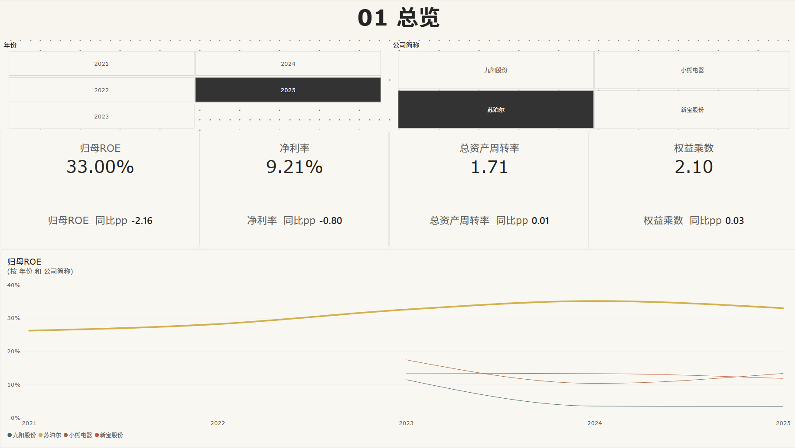
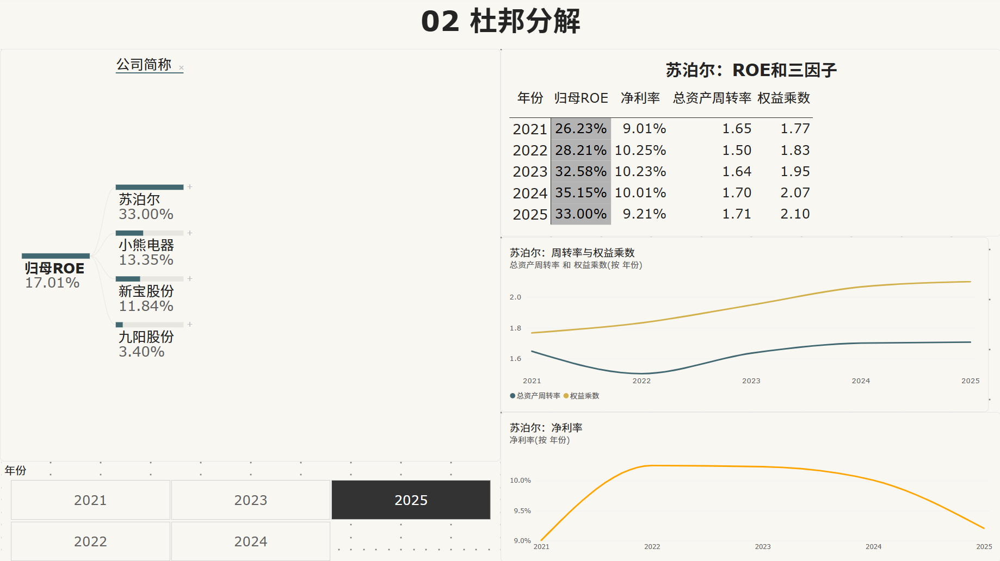
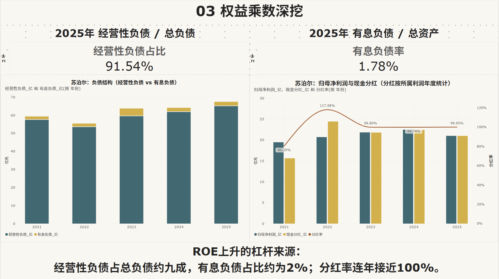
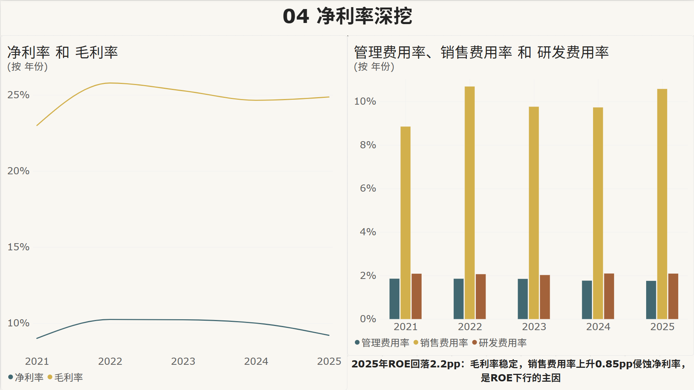

# 苏泊尔杜邦分析看板：ROE 三因子分解与同业对标

> 基于 A 股上市公司年报数据的杜邦分析项目，以苏泊尔（002032）为主分析对象、三家小家电同业为对标，构建"三表建模 → DAX 三因子度量值 → 分解树 + 因子矩阵逐层归因"的 Power BI 分析体系，把 ROE 的上升与回落分别追溯到具体因子和具体报表科目。


---

## 📌 项目概览

以**归母 ROE = 销售净利率 × 总资产周转率 × 权益乘数**为分析框架，取苏泊尔 2020–2025 年及九阳股份、小熊电器、新宝股份三家可比公司年报数据，在 Power BI 中完成星型建模与 DAX 度量值体系，四页看板依次回答四个递进的问题：

1. **ROE 处于什么水平？**（总览：KPI 同比 + 五年同业对标）
2. **由哪个因子驱动？**（杜邦分解：分解树定位公司，因子矩阵定位因子）
3. **ROE 为什么上升？**（权益乘数深挖：负债结构 + 分红政策）
4. **ROE 为什么回落？**（净利率深挖：毛利率 vs 费用率）

**核心视角**：不止步于"算出三因子"，而是把杜邦作为**归因工具**。三因子中有两个发生了变化，看板为每个变化因子各配一页深挖：权益乘数解释 2021–2024 年的上升，净利率解释 2025 年的回落。

---

## 🎯 核心成果速览

### 看板预览

#### 页面1：总览（KPI + 五年同业对标）


#### 页面2：杜邦分解（分解树 + 三因子矩阵与趋势）


#### 页面3：权益乘数深挖（负债结构 + 分红率）


#### 页面4：净利率深挖（毛利率 vs 费用率归因）


---

## 💡 关键发现与业务洞察

| 类别 | 发现 | 业务解读 |
|---|---|---|
| **ROE 驱动结构** | 苏泊尔归母 ROE 从 2021 年 26.2% 升至 2024 年 35.2%；同期净利率（约 10%）与周转率（1.5–1.7）基本走平，权益乘数从 1.77 升至 2.10 | ROE 爬升几乎完全由杠杆因子贡献 |
| **杠杆来源①：经营性占款** | 应付票据、应付账款、合同负债等经营性负债占总负债 88%–92%；有息负债率（占总资产）常年约 2%，最高为 2023 年的 3.2% | 公司几乎不依赖银行融资，而是占用上下游资金维持资产规模——杠杆的利息成本接近于零，本质是产业链话语权 |
| **杠杆来源②：高分红** | 分红率连年接近 100%，2022 年达 118%（分红超过当年利润）；五年累计归母净利润约 105 亿、累计分红约 105 亿，净资产由约 76 亿降至约 63 亿 | 利润几乎全部分出，权益乘数的分母被持续压缩 |
| **2025 年拐点归因** | ROE 回落 2.2pp 至 33.0%；周转率、乘数仍在上行，唯净利率由 10.0% 降至 9.2% | 分解树 + 因子矩阵锁定净利率为唯一下行因子 |
| **费用级钻取** | 毛利率保持约 24.9%，销售费用率由 9.73% 升至 10.58%（+0.85pp），管理、研发费用率走平 | 净利率下滑源于销售投入加大，而非成本端问题 |
| **同业对标** | 2025 年归母 ROE：苏泊尔 33.0% vs 小熊电器 13.4% / 新宝股份 11.8% / 九阳股份 3.4% | "高周转 + 无息杠杆 + 稳定净利率"的组合在同业中显著领先 |

> 彩蛋：本项目与 [零售收入质量分析项目](https://github.com/taohuiling2010-bot/retail-financial-analysis-dashboard) 存在数据线索呼应——零售项目中识别出的 POS 混录记录正是"苏泊尔压力锅优惠券"，本项目顺着该线索对苏泊尔本尊的财报做了完整拆解。

---

## 🛠️ 技术栈

- **数据加工**：Excel（结构化录入模板：勾稽校验列、SUMIFS 跨表速算、因子乘积恒等式复核、负债结构与分红专项分析页）
- **可视化**：Power BI Desktop（星型建模、DAX 度量值、分解树、编辑交互、组合图双坐标轴）
- **核心技术点**：
  - 星型模型：双事实表（利润表/资产负债表）+ 双维度表（公司/年份），单向筛选
  - DAX 筛选上下文操控：`CALCULATE + FILTER + ALL` 实现期初余额跨年取数
  - 平均余额口径：`(期初 + 期末) / 2`，`ISBLANK` 守卫拦截期初缺失年份
  - 分解树沿"公司"维度下钻，因子矩阵负责因子归因——两个视觉对象分工互补
  - 切片器"编辑交互"筛选豁免，页面级 / 视觉级筛选器分层控制作用范围
  - Excel 侧与 DAX 侧**双路径交叉验证**（同一指标两种算法逐格对账）

---

## 📂 仓库结构

```
.
├── README.md                              本文件，项目门面
├── 01_数据/
│   └── 杜邦分析_数据录入及分析.xlsx        三表数据 + 勾稽校验 + 杜邦速算 + 负债结构与分红分析
├── 02_可视化看板/
│   ├── 杜邦分析看板.pbix                   Power BI 完整源文件（可下载交互体验）
│   └── 看板截图_PDF版.pdf                  4 页看板合订 PDF
└── 03_看板截图_单页/
    ├── 页面1_总览.png
    ├── 页面2_杜邦分解.png
    ├── 页面3_权益乘数深挖.png
    └── 页面4_净利率深挖.png
```

---

## 🧮 核心 DAX 度量值

**期初余额：筛选上下文的拆装**（解决"平均余额需要上年期末数"）

```dax
期初总资产 =
CALCULATE(
    [期末总资产],
    FILTER( ALL('dim年份'), 'dim年份'[年份] = MAX('dim年份'[年份]) - 1 )
)
-- ALL 只拆除年份维度的筛选器（公司筛选保留），再重装"当前年份-1"
```

**平均余额：缺期初则拒绝计算**

```dax
平均总资产 =
IF( ISBLANK([期初总资产]), BLANK(), ([期初总资产] + [期末总资产]) / 2 )
-- 守卫拦截：无期初数的年份返回空白，而非按 (0+期末)/2 输出错误的"半值"
```

**三因子与 ROE**

```dax
净利率       = DIVIDE( [归母净利润], [营业总收入] )
总资产周转率 = DIVIDE( [营业总收入], [平均总资产] )
权益乘数     = DIVIDE( [平均总资产], [平均归母权益] )
归母ROE      = [净利率] * [总资产周转率] * [权益乘数]
-- ROE 由三因子相乘构成；Excel 速算表中 ROE 独立直算——两条路径交叉验证
```

**负债结构**

```dax
经营性负债占比 = DIVIDE( [经营性负债], SUM('fact_资产负债表'[负债合计]) )
有息负债率     = DIVIDE( [有息负债], [期末总资产] )
-- 两个比率分母不同：经营性负债看负债内部结构，有息负债率按行业惯例以总资产为分母
```

---

## ⚠️ 数据与口径说明

- **数据来源**：各公司年报 PDF「财务报告」节的合并资产负债表与合并利润表，手工录入并经勾稽校验（资产 = 负债 + 权益、净利润 = 归母 + 少数，全部行差额为 0）
- **单位**：元（与年报原文一致）；看板内格式化为亿元/百分比显示
- **ROE 口径**：分子为**归属于母公司股东的净利润**，分母为**归属于母公司所有者权益**的期初期末简单平均。与年报披露的"加权平均净资产收益率"（证监会口径，考虑分红/增发时点权重）存在 1–2pp 差异，属口径差异而非数据错误
- **平均余额**：总资产、归母权益均取期初期末平均，因此录入了 2020 年末资产负债表数据作为 2021 年期初数；对标公司自 2023 年起展示因子（2022 年为期初基准年）
- **负债分类**：经营性负债 = 应付票据 + 应付账款 + 合同负债 + 应付职工薪酬 + 应交税费；有息负债 = 短期借款 + 一年内到期的非流动负债 + 租赁负债（长期借款、应付债券各年均为零）
- **分红口径**：现金分红按**所属利润年度**统计（如"2025 年度分红"对应 2025 年利润），实际宣告和支付发生在次年，因此对年末净资产的压缩效应滞后一年
- 负债结构与分红分析仅针对苏泊尔；本项目数据全部来自公开披露的年报，仅用于个人学习与作品集展示

---

## 🚀 快速浏览

**如果你只有 30 秒**：直接看上面"看板预览"的 4 张截图 + 关键发现表前三行

**如果你只有 5 分钟**：浏览本 README 完整内容

**如果你想交互体验**：下载 [杜邦分析看板.pbix](02_可视化看板/杜邦分析看板.pbix)，需要 Power BI Desktop（免费，[微软官方下载](https://powerbi.microsoft.com/zh-cn/desktop/)）——推荐在页 2 切换年份切片器并展开分解树

---

## 🌐 Project Summary (English)

**Overview**: A four-page DuPont analysis dashboard built in Power BI, decomposing the ROE of Supor Co., Ltd. (SZ: 002032) and three domestic small-appliance peers over FY2020–2025. Data was manually extracted from audited annual reports into a structured Excel template with built-in accounting-identity checks, then modeled as a star schema (two fact tables, two dimension tables) with DAX measures handling prior-year balance retrieval via filter-context manipulation (`CALCULATE + FILTER + ALL`).

**Key Findings**: Supor's ROE climbed from 26.2% (2021) to 35.2% (2024) with net margin and asset turnover essentially flat — the rise was driven almost entirely by the equity multiplier (1.77 → 2.10). The leverage is nearly interest-free: operating liabilities (notes and accounts payable, contract liabilities, etc.) make up 88–92% of total liabilities, while interest-bearing debt stays around 2% of total assets (peaking at 3.2% in 2023). Meanwhile, a near-100% dividend payout (118% in 2022) kept book equity shrinking from about RMB 7.6bn to 6.3bn despite RMB 10.5bn in cumulative net profit. In 2025, ROE fell 2.2pp to 33.0%; factor decomposition isolates net margin (10.0% → 9.2%) as the sole declining driver, and expense-level drill-down attributes it to a 0.85pp rise in the selling expense ratio rather than gross margin, which held steady at about 24.9%. Against peers (Bear 13.4%, Donlim 11.8%, Joyoung 3.4% in FY2025), Supor's factor mix remains decisively superior.

---

## 📮 联系方式

- **作者**：陶惠灵
- **邮箱**：thlthl2010@yeah.net
- **GitHub**：[@taohuiling2010-bot](https://github.com/taohuiling2010-bot)
- **Gitee 国内镜像**：[gitee.com/taohuiling2010/dupont-analysis-powerbi](https://gitee.com/taohuiling2010/dupont-analysis-powerbi)

如对项目有任何疑问或建议，欢迎通过 Issue 或邮件联系。
